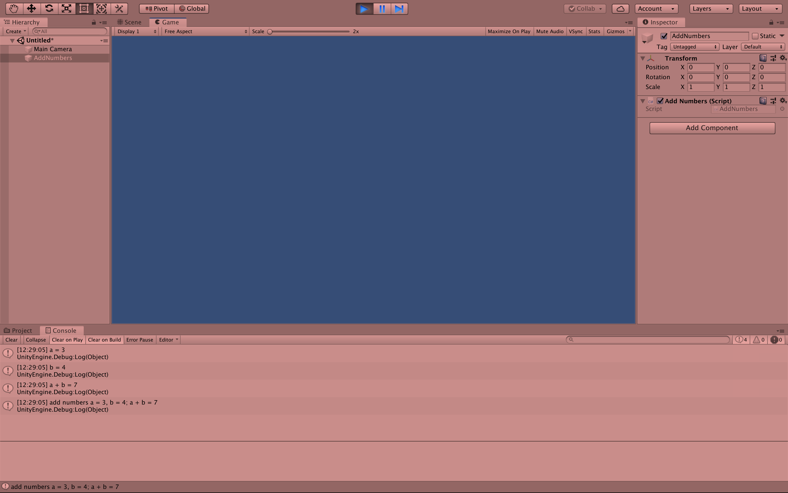

# MyThirdScript-cs-millig

###Project Description:

The aim of this project is twofold:
+First, it serves practicing the git/GitHub workflow, including writing a meaningful README
+Second, this is the first time using a debug message with concatinations of strings and variables

###Development Platform:

MacOs Mojave 10.14.6, Unity 2019.1.14f1, Visual Studio Code 1.30.2

###Target Platform:

WebGL (RefRes: 1280x720 HD-720p)

###Screenshots:

###Lessons Learned:

+practice workflow, learn how to use a debug message with strings and variables

